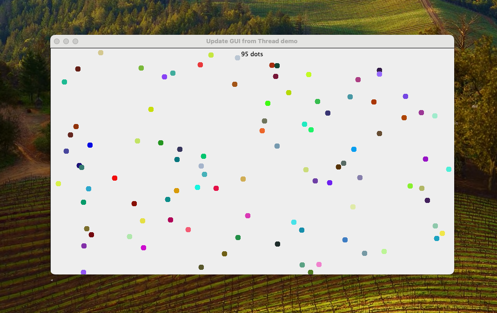

# UpdateFromThread demo

This demo shows how to do work in an application **thread** and update the state of the app Swing GUI from that thread.

Classes:

* `DotModel` contains dots that moved within a rectangle (the view), bouncing from the "walls". Code is executed in a **thread**, changing the point locations several times a second. After updating the dots, the *observer* is notified to update the view.
* `Dot`s are the dots in the model, having a coordinate point, movement direction and a colour.
* `DotModelObserver` is notified by the `DotModel` as the dots have changed position.
* `GraphicsPanel` is the **observer**, drawing the dots on the view when notified by the `DotModel`, additionally displaying the number of dots in a `JLabel`.
* `GUIApp` implements the `main` and building the app Swing GUI with `JFrame`, `GraphicsPanel` and the `DotModel`.



You can create new dots by clicking on the view with your mouse. If you want to clear all the points away, do alt-click. You may also resize the window to give more (or less) room for the dots to bounce.

Take a loot at the code in `DotModel.run()` to see what the thread does, and how it notifies the observer (`GraphicsPanel`) when dot locations have been updated.

Then see how the `GraphicsPanel.dotsMoved()` updates the label telling the number of dots currently visible, and tells Swing to update the view by calling `repaint()`. Basically, Swing components should not be directly manipulated here, e.g. calling drawing methods or updating label contents (things done in `paint(Graphics g)` where the dots are drawn), since this method is called by our `DotModel` thread.

Note what is printed out in the console when the demo is running. It shows the name of the thread in the context of which the `GraphicsPanel.dotsMoved()` is called. This printout may be commented out, so remove the comments in that case to see the logs printed out.

Then comment the two lines (labeled `#1` and `#2`) as instructed in the comments of `GraphicsPanel.dotsMoved()`. Run the app again and now you see (from the printouts) that the code is executed in the context of the `DotModel` worker thread, *not* the Swing thread as it is supposed to. In some environments, this actually causes an exception, but in some environments, not. Why this happens, I do not know. If you have an idea, please tell.

You may also try out doing things even more worse ways; drawing the graphics directly in `dotsMoved()` to see what happens then...:

```Java
    public void dotsMoved() {
        int dotCount = model.getDotCount();
        dotsCountLabel.setText(String.format("%d dot%s", dotCount, dotCount != 1 ? "s" : ""));
        List<Dot> dots = model.getDots();
        Graphics g = getGraphics();
        for (Dot dot : dots) {
            g.setColor(dot.color);
            g.fillOval((int) dot.point.getX(), (int) dot.point.getY(), DotModel.DOT_SIZE, DotModel.DOT_SIZE);
        }
    }
```

## Why this was done

This demo was done by Antti Juustila, INTERACT Research Unit, University of Oulu, Finland.

The demo is for an introductory course on GUI programming, where most of the students work with Java Swing.
